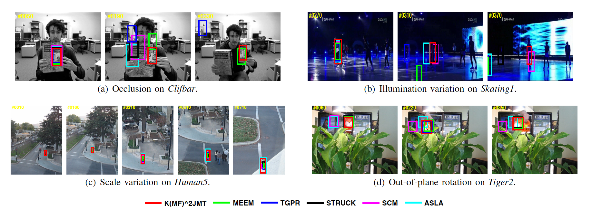

# Robust Visual Tracking using Multi-Frame Multi-Feature Joint Modeling




It remains a huge challenge to design effective and efficient trackers under complex scenarios, including occlusions, illumination changes and pose variations. To cope with this problem, a promising solution is to integrate the temporal consistency across consecutive frames and multiple feature cues in a unified model. Motivated by this idea, we propose a novel correlation filter-based tracker in this work, in which the temporal relatedness is reconciled under a multi-task learning framework and the multiple feature cues are modeled using a multi-view learning approach. We demonstrate the resulting regression model can be efficiently learned by exploiting the structure of blockwise diagonal matrix. A fast blockwise diagonal matrix inversion algorithm is developed thereafter for efficient online tracking. Meanwhile, we incorporate an adaptive scale estimation mechanism to strengthen the stability of scale variation tracking. We implement our tracker using two types of features and test it on two benchmark datasets. Experimental results demonstrate the superiority of our proposed approach when compared with other state-of-the-art trackers.

_Index Terms_—Visual Tracking, Multi-task Learning, Multiview Learning, Blockwise Diagonal Matrix, Correlation Filters.


## Download

[PDF](https://github.com/dscv-lab/KMF2JMTtracking/releases/download/V1.0/KMF2JMTtracking.pdf)

[Supplementary (Complete Experimental Results)](https://github.com/dscv-lab/KMF2JMTtracking/releases/download/V1.0/supplementary_material.pdf)

[Matlab Code](https://github.com/dscv-lab/KMF2JMTtracking/releases/download/V1.0/code.zip)

[Precomputed Results](https://github.com/dscv-lab/KMF2JMTtracking/releases/download/V1.0/results.tar.gz) on [OTB-2015 dataset](http://cvlab.hanyang.ac.kr/tracker_benchmark/datasets.html)

**Users of our code are asked to cite the following publication:**

```
@article{zhang2018kmf2jmt,
    title={Robust Visual Tracking using Multi-Frame Multi-Feature Joint Modeling},
    author={Peng Zhang, Shujian Yu, Jiamiao Xu, Xinge You, Xiubao Jiang, Xiao-Yuan Jing, and Dacheng Tao},
    journal={IEEE Transactions on Circuits and Systems for Video Technology (accepted)},
    year={2018}
}
```


## DEMO

| Name     | View online                                          | Download                                                     |
| -------- | ---------------------------------------------------- | ------------------------------------------------------------ |
| ClifBar  | [Youtube](https://www.youtube.com/embed/ysvYw_iiLs4) | [Download(11M)](https://1drv.ms/v/s!Ar1lIHksKLYAkm4lfTsG4GoEZwhG) |
| Tiger2   | [Youtube](https://www.youtube.com/embed/hUIAfKHfXRw) | [Download(13M)](https://1drv.ms/v/s!Ar1lIHksKLYAkmxjBlPhJ8Ex_BhA) |
| Skating1 | [Youtube](https://www.youtube.com/embed/Rv5fofYrrDM) | [Download(19M)](https://1drv.ms/v/s!Ar1lIHksKLYAkm2XL8SMDS40OTFG) |
| Human5   | [Youtube](https://www.youtube.com/embed/1YLvFNRT_6A) | [Download(23M)](https://1drv.ms/v/s!Ar1lIHksKLYAkm95ZU6lEoOU4rhr) |
